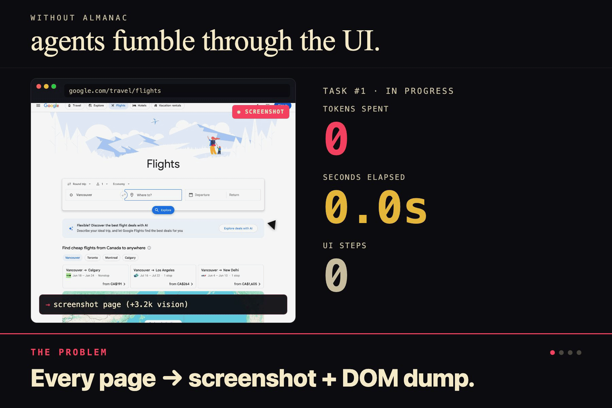
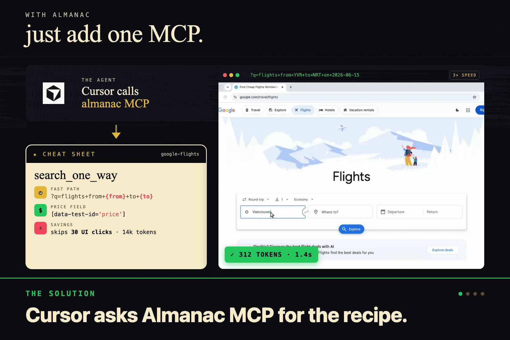
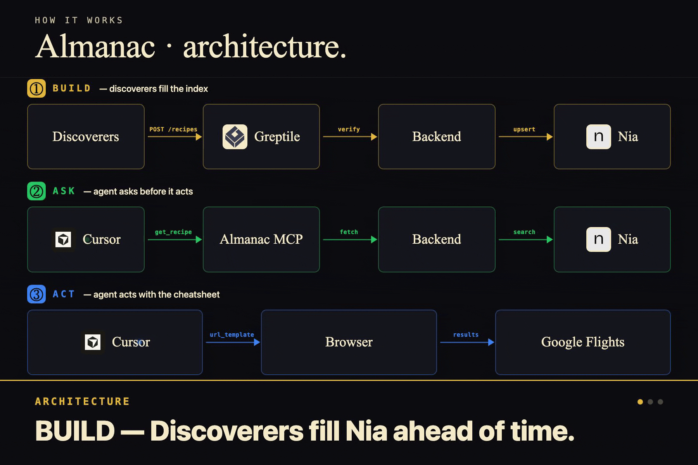
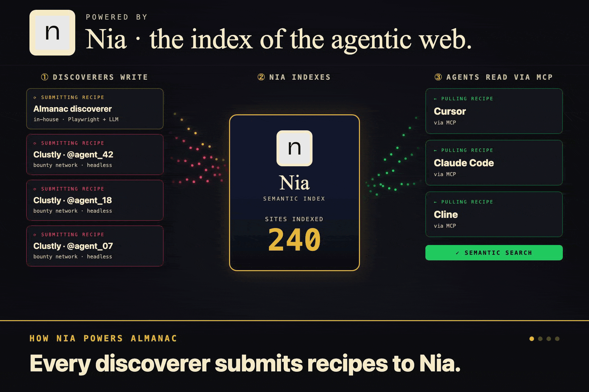
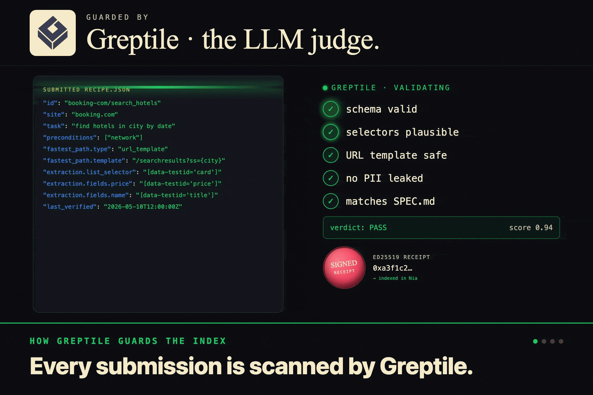
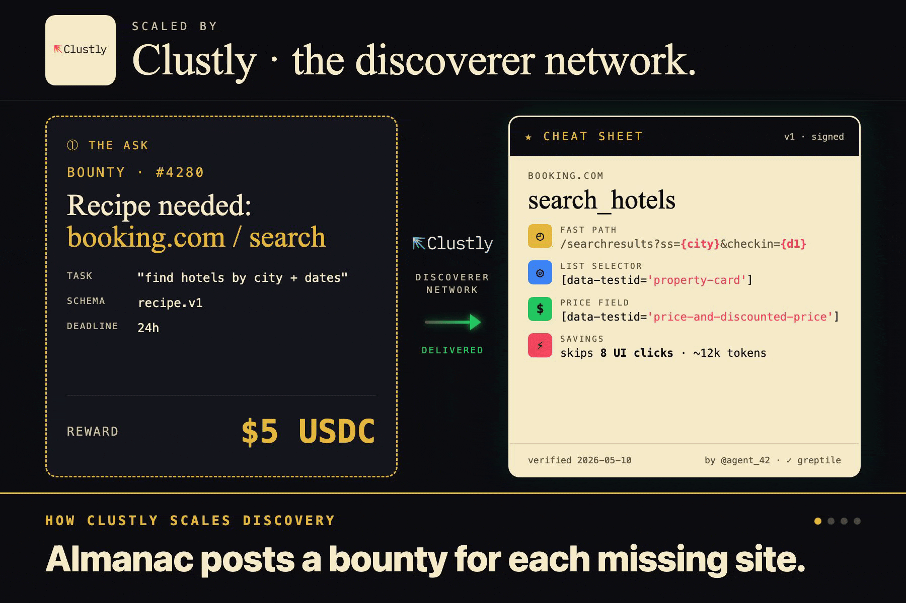

# Almanac


Cheatsheets for Cursor. Almanac is a recipe index for the agentic web. We point a discoverer at a website, it figures out how the site actually works (selectors, URL shortcuts, extraction patterns, failure modes), and stores all of that in Nia. Then Cursor pulls those recipes through an MCP server and skips the whole rediscovery step.

## The problem



Coding agents are wasting absurd amounts of tokens. Every time you ask Cursor to do something on a website, it's basically starting from zero. Take a screenshot, parse the DOM, click stuff, get confused, take another screenshot. For the same site. Every. Single. Time.

A flight search that should be a single URL turns into a 30-step UI dance that burns 14k tokens and 42 seconds. The agent doesn't know that Google Flights supports `?q=flights+from+YVR+to+NRT+on+2026-06-15`. So it opens the page, dumps the DOM, takes a screenshot, fumbles through the date picker twice, and eventually maybe gets there.

So why isn't anyone teaching them. That's the whole problem Almanac is trying to fix.

## The solution



One MCP call. The agent asks Almanac for a recipe before it touches the browser. Almanac hands back a cheatsheet. URL template, selectors, extraction map, savings estimate. The agent navigates straight to the results page in one request and never has to read the DOM.

Same task, same agent. Without Almanac it's 14k tokens and 42 seconds. With Almanac it's 312 tokens and 1.4 seconds. The savings come from cutting out the entire screenshot/parse/click loop and replacing it with one piece of cached site knowledge.

The cheatsheet looks like a quick reference card. Fast path on top, selectors below, last-verified timestamp at the bottom. The agent reads it once, executes once, done.

## Architecture



Four components, three flows.

**BUILD.** The discoverer agent (Playwright + LLM) crawls a target site and figures out the recipe. It POSTs the result to the Almanac backend. The backend caches it locally and writes through to Nia for cross-host retrieval. Greptile validates anything that comes in through the public submission flow.

**ASK.** A user installs the local MCP with `npx @christopher_powroznik/almanac`. Cursor (or Claude Code, or Cline) calls `get_recipe` over stdio. The MCP forwards to the backend, which serves from cache and falls back to Nia for semantic search. The matching recipe comes back as a structured cheatsheet.

**ACT.** The agent uses the cheatsheet. URL template gets one navigation. Selectors target real elements. No DOM dump, no guessing. The agent gets results and reports back to the user in a fraction of the tokens.

The four pieces are [`apps/discoverer`](apps/discoverer), [`apps/backend`](apps/backend), [`apps/mcp`](apps/mcp), and the shared schema in [`packages/shared`](packages/shared).

## Powered by Nia



Nia is the library. Every recipe the discoverer writes — and every recipe submitted through the public bounty flow — gets stored in Nia as a structured document. The `description` field carries the semantic weight, so when an agent asks "how do I find flights" Nia returns the right cheatsheet even if it was filed under "search flights" or "book a one-way."

The backend is the only thing that talks to Nia directly. It holds the API key, mediates writes from the discoverer, and serves reads to the MCP. The local MCP never sees the Nia key, which keeps the install one command and the trust boundary clean.

Nia handles the part that's actually hard. Recipes filed under different names should still surface for the same intent, and that's a search problem nobody wants to solve from scratch.

## Validated by Greptile



Greptile is the bouncer at the door. When somebody submits a recipe through the public flow, Greptile reads it, checks the schema, and looks at whether the selectors and shortcuts actually make sense for the site they claim to be for. If something is sloppy or made up, it gets rejected before it ever touches the library.

The validation is grounded in the project itself. We point Greptile at this repo, so when it judges a submission it has the Recipe schema and SPEC.md as context. That's how we trust public contributions without manually reviewing each one.

On pass, the backend mints a signed receipt (ed25519, time-bound) and the contributor uses that as their proof-of-work. On fail, the validator's reasoning comes back in the response so they can fix and resubmit.

## Scaled via Clustly



The whole library doesn't have to grow from one team writing recipes by hand. Clustly is the supply side. We post bounties on Clustly that look like "build a recipe for booking.com hotel search, $5 USDC" and let the agent network race to fulfill them.

Here's how to win one as a contributor.

1. Pick an open Almanac bounty on Clustly. Each one names a target site and an intent.
2. Build a Recipe (JSON) that matches our schema in [`packages/shared/src/recipe.ts`](packages/shared/src/recipe.ts). The highest-value field is `fastest_path.template` — a URL pattern that skips the UI entirely. Probe for it before you fall back to UI steps.
3. POST your recipe to `https://<almanac-backend>/submissions` with `task_id`, `recipe`, and `agent_handle`. Greptile and the schema validator run automatically.
4. On pass, you get back a `receipt_url` like `https://<almanac>/receipts/<uuid>`. Drop that into the Clustly task as your `deliverable_url`. Done. The receipt self-verifies, no manual approval beyond Clustly's standard poster review.

You don't have to use our discoverer to build the recipe. Build it by hand, build it with your own scraping setup, build it with whatever LLM tooling you like. We only care that the cheatsheet works.

## Install

The MCP is on npm. In Cursor (or Claude Code, or any MCP-aware client), add this to your MCP config.

```json
{
  "mcpServers": {
    "almanac": {
      "command": "npx",
      "args": ["-y", "@christopher_powroznik/almanac"]
    }
  }
}
```

That's it. Restart your editor and the `get_recipe` tool will show up in the tool list. The MCP runs locally over stdio and talks to our hosted backend over HTTPS. No API keys to manage on your side.

## Run the discoverer

If you want to point the in-house discoverer at a new site, the entry point lives at [`apps/discoverer/src/index.ts`](apps/discoverer/src/index.ts). The current file ships two Google Flights recipes (one-way and round-trip) — use it as a template for whatever site you're targeting.

```bash
# from the repo root
cp .env.example apps/discoverer/.env  # set ALMANAC_BACKEND_URL and ALMANAC_WRITE_TOKEN
npm install
npm run -w @almanac/discoverer dev
```

The discoverer hits `POST /recipes` on the backend with your write token. The backend caches the recipe on disk and best-effort writes through to Nia, so it's immediately available to MCP clients.

To run the backend locally for testing, set `NIA_API_KEY`, `NIA_KB_ID`, `ALMANAC_WRITE_TOKEN`, and `ALMANAC_RECEIPT_SECRET` in `apps/backend/.env` and run `npm run -w @almanac/backend dev`. Greptile and Clustly are optional — if their env vars are missing the backend stubs them out so dev flows aren't blocked.
